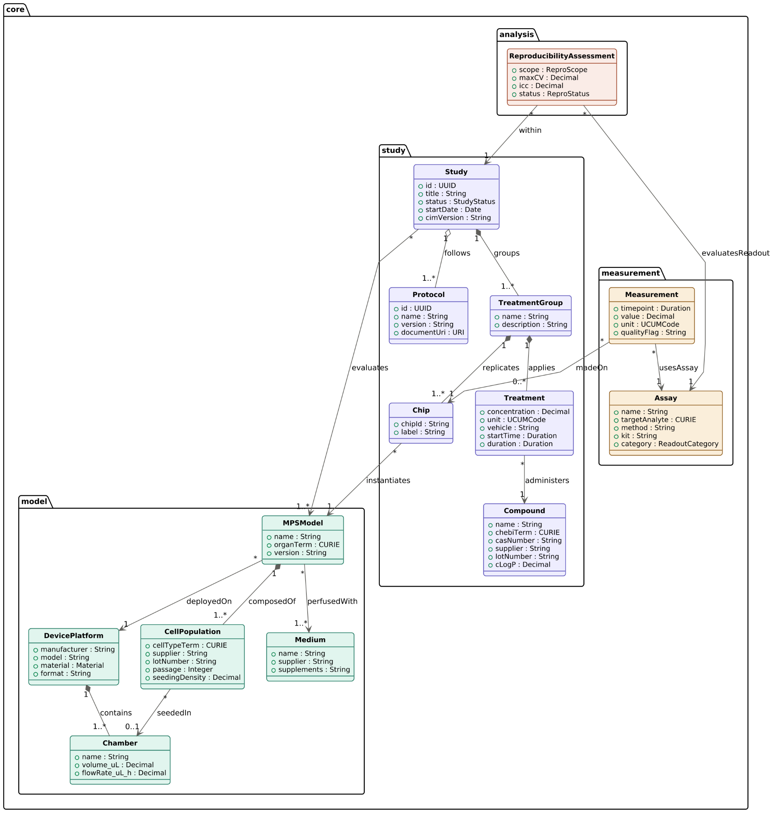

# MPS Common Information Model

**Community proposal | Initial class diagram | Open for review**

[Review the proposal](https://github.com/PhysioVerse-OSE/mps-model-system-descriptors/issues/new?template=cim-proposal-review.yml) · [Scope and use cases](SCOPE.md) · [Concept inventory](CONCEPTS.md) · [Field mapping](FIELD_MAPPING.md) · [Review questions](REVIEW_QUESTIONS.md)

A Common Information Model (CIM) describes shared concepts and relationships for MPS models, experiments, assays, measurements, and supporting evidence. This proposal provides a starting point for community review of those relationships. It is not an adopted standard, an implemented exchange schema, or a replacement for the current PhysioVerse data model.

## Initial Class Diagram

The original community-contributed diagram is preserved. The preview uses a white background so the original labels and relationships remain visible in light and dark page themes. No classes, attributes, or relationships have been redrawn. [Open the original diagram](mps-cim-original.png) or read the [text inventory](CONCEPTS.md).

## Scope of This Iteration

The diagram represents model components, study structure, compound treatments, numerical measurements, and reproducibility-assessment fields. Its `Chip` and `Compound` concepts make chip-based compound-exposure studies a practical initial review case. Broader coverage of organoids, tissue equivalents, other interventions, and multimodal data is a question for review, not an assumed capability of this iteration.

## How to Contribute

Choose one class, relationship, field, or use case. Explain the problem it addresses, cite a public source where available, and propose a focused revision. Identify whether the statement is visible in the current diagram, reported in a study, or a new proposal.

Use the [CIM review form](https://github.com/PhysioVerse-OSE/mps-model-system-descriptors/issues/new?template=cim-proposal-review.yml) for scientific or technical input. A pull request can propose changes to these documents or contribute an editable model source with its attribution. Keep discussion, evidence, and decisions in the related GitHub thread.

## First Review Tasks

1. Define the initial use cases and the questions the model must answer.
2. Map two or three real public studies to the diagram. Preserve original identifiers and explicitly record information that is not reported.
3. Compare concepts with current PhysioVerse metadata and established frameworks before proposing new terms or machine-checkable rules.

A structurally complete record is not proof of biological validity, reproducibility, or fitness for a particular use. Assessment criteria require a stated purpose, supporting observations, and a documented method.

## Related PhysioVerse Work

| Project | Review contribution |
|---|---|
| [Minimum metadata](https://github.com/PhysioVerse-OSE/mps-minimum-metadata) | Field definitions, requirement levels, missingness, and collection burden |
| [Experimental conditions](https://github.com/PhysioVerse-OSE/mps-experimental-conditions) | Culture conditions, interventions, units, and timing |
| [Assays and endpoints](https://github.com/PhysioVerse-OSE/mps-assay-endpoint-dictionary) | Assay identity, measured endpoints, analytes, and measurement context |
| [Multimodal data](https://github.com/PhysioVerse-OSE/mps-multimodal-data-standard) | Sample-to-file relationships, original identifiers, and processing history |
| [Validation](https://github.com/PhysioVerse-OSE/mps-validation-framework) | Evidence organized around a defined intended use |
| [Reproducibility](https://github.com/PhysioVerse-OSE/mps-reproducibility-commons) | Experimental units, repeated observations, and within- and between-laboratory evidence |

## Background Resources for Alignment

These resources are candidates for alignment, not dependencies already implemented by this proposal.

- [PhysioVerse contributor metadata](https://physioverse.org/contributor-metadata): existing biological, experimental, assay, and file context.
- [ISA Abstract Model](https://isa-specs.readthedocs.io/en/latest/isamodel.html): investigation, study, assay, material, process, and data relationships.
- [W3C PROV-O](https://www.w3.org/TR/prov-o/): entities, activities, and agents for provenance representation.
- [Wilkinson et al., FAIR Guiding Principles](https://doi.org/10.1038/sdata.2016.18): a framework for findability, accessibility, interoperability, and reuse.
